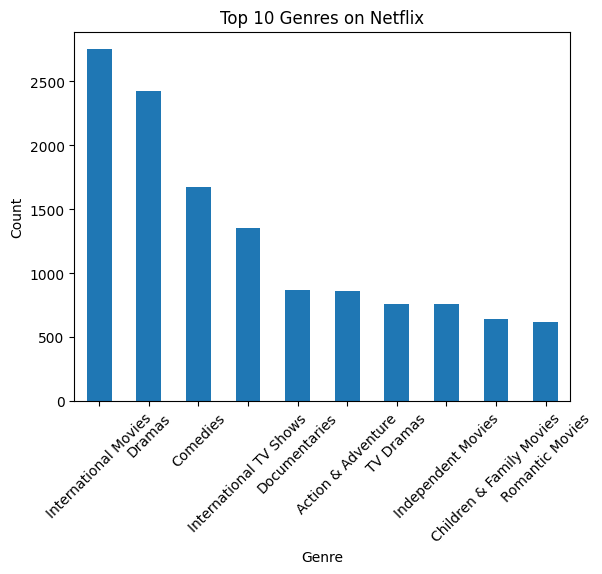
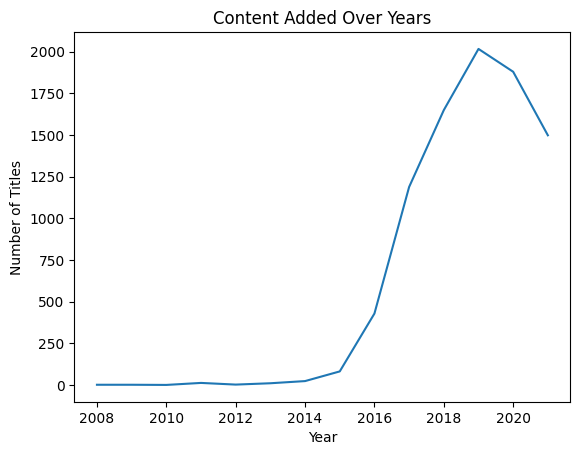
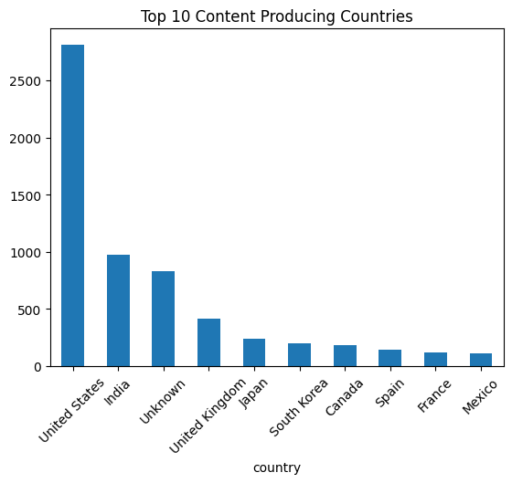

#  Netflix Data Analysis Using Python

# Project Overview
This project performs Exploratory Data Analysis (EDA) on the Netflix Movies and TV Shows dataset using Python.

The objective is to extract meaningful insights regarding content trends, genres, growth patterns, and movie durations.

# Technologies Used
- Python
- Pandas
- NumPy
- Matplotlib
- Seaborn

# Key Analysis Performed
- Data cleaning and handling missing values
- Genre distribution analysis
- Year-wise content growth analysis
- Country-wise content distribution
- Movie duration distribution

#  Key Insights
- Netflix experienced rapid content growth after 2016.
- Drama and International genres dominate the platform.
- United States contributes the highest number of titles.
- Most movies fall within the 90–120 minute duration range.

#  Visualizations

# Top Genres

# Content Growth Over Years

# Country Distribution

# Movie Duration Distribution

MADE BY BHUMI JAIN 

## 📎 Conclusion
This project demonstrates the use of Python-based data analysis techniques to extract business insights from structured real-world datasets.
